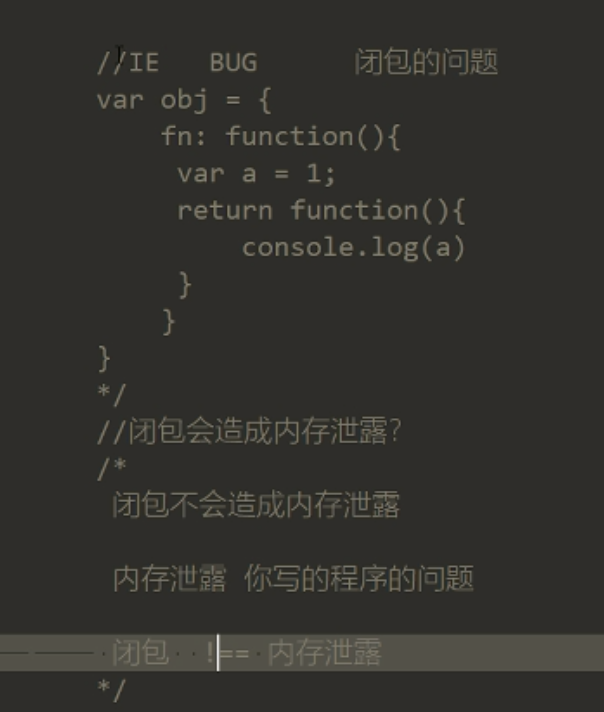
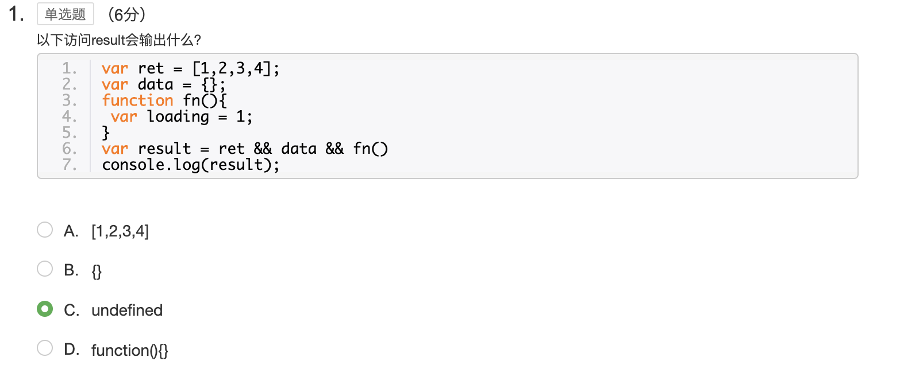

# jQuery核心源码解析（一）


​	本文是个人参加网易前端微专业的学习笔记，内容主要集中在jQuery核心功能函数的实现，在理解的基础上总结的一份文档，作为个人的学习记录与思考过程，以备后期查阅。学习源码是一个分层剥离，逐步渐进提升的过程。


[TOC]

## 一、jQuery实例构建及extend函数解析

​	对于源码的学习还是要注重它的思想，通过一层层剥离源码的外衣，思考它实现的思路与原因，才能进阶到和源码作者同等思维上。jQuery是一个可以实现高效页面编程的js库。内部通过定义jQuery实例对象，在这个实例对象上实现了各种能够提高页面编程的工具API，通过这些API我们可以通过js快速构建页面。

### 1. 模块入口

​	模块入口都是通过一个自执行函数来实现，使用自执行函数结构，形成一个模块。通过传入环境的this，来做一些前置操作，之后调用factory执行。

```javascript
// 入口
(function (global, factory) {
  // 判断环境
  //...
    
  factory(global)
})(this, function (root) {
   // 工厂函数
   // ...
})
```

可以简化为：

```javascript
// 入口
(function (context) {
  // 工厂函数内容
  
})(this)
```

### 2. 共享原型对象

​	共享原型对象是，jQuery实例化的核心实现手段。

```javascript
var jQuery = function() {
    return new jQuery.prototype.init();
}
jQuery.fn = jQuery.prototype = {
    init: function() {

    },
    css: function() {

    }
}
// 这一步的操作是让init函数也能够继承jQuery.fn上定义的属性与方法，在实例的时候继承。
jQuery.fn.init.prototype = jQuery.fn
```

​	其中真正的构造函数是init函数，而jQuery通过返回`new jQuery.prototype.init();`来返回init构造函数。new操作符是通过创建一个Object ，然后调用构造函数，将构造函数的结果返回给这个对象。

> 思考：为什么不能直接通过返回new一个jQuery实例对象，而要使用共享原型对象。有什么不便之处。

​	首先搞清楚实例对象和原型对象的区别，实例对象是通过原型链继承后的对象，在原型链末端。而原型对象是在原型链的上游。如果通过返回new来创建，会不断的调用JQuery实例对象的构造函数，构造函数再不断的返回new，再去调用构造函数，这样形成死循环。并不是我们想要的效果。我们想要的就是**通过原型链生成的新的实例对象**。而不是通过new去构造。


> 关注点1：对于框架的中传参，一定要进行类型校验，以免报错。

​	对于共有方法，你要暴露给外部使用的函数，一定要做类型校验，因为你不能避免其他人调用方法传入错误数据类型导致的严重问题。

> 关注点2：if ((a=b) !== undefined)   写法，给a赋值b, 同时判断赋值不等于undefined

> 关注点3：深拷贝和浅拷贝的理解，关于对象引用，赋值改变，前一个对象的属性值是否改变，为什么?

​	值类型是在栈内存中，引用类型是在堆内存中。深拷贝是值拷贝，浅拷贝对于复杂数据类型来说是引用拷贝。

### 3. extend实现

​	extend方法是为了能够在JQuery原型对象上扩展属性与方法提供了一种通用工具，使得对外扩展提供了可能，不用所有都手动写在原型对象上，统一提取一个方法实现。

```javascript
// jQuery的扩展方法
jQuery.fn.extend = jQuery.extend = function() {
    var target = arguments[0] || {};
    var length = arguments.length;
    var i = 1;
    var deep = false;
    var option, name,copy,src,copyIsArray,clone;
    if (typeof target === "boolean") {
        deep = target;
        target = arguments[1];
        i = 2;
    }
    if (typeof target !== "object") {
        target = {};
    }
    //参数的个数 1
    if (length === i) {
        target = this;
        i--;
    }
    //浅拷贝  深拷贝 
    for (; i < length; i++) {
        if ((option = arguments[i]) != null) {
            for (name in option) {
                copy = option[name];
                src = target[name];
                if(deep && (jQuery.isPlainObject(copy) || (copyIsArray = jQuery.isArray(copy)))){
                    if(copyIsArray){
                        copyIsArray = false;
                        // 当copy是数组时，会覆盖target，不管target是否是数组。
                        clone = src && jQuery.isArray(src) ? src : [];
                    } else {
                        clone = src && jQuery.isPlainObject(src) ? src : {};
                    }
                    target[name] = jQuery.extend(deep, clone, copy);
                } else if(copy != undefined){
                    target[name] = copy;
                }
            }
        }
    }
    return target;
}

```

JQuery属性与方法扩展的关键：extend，相当于采用工厂模式，实现一个通用的方法，提供给一个对象或者添加自定义方法的工具，关键是提供给jQuery扩展自己的能力，方法。通用能力的关键性。 所以JQuery框架，提供了extend方法用来自定义扩展。对修改封闭，对扩展开发，这也正是函数的思想。


> 关于深拷贝和浅拷贝边界的问题：


## 二、jQuery选择器实现

​	jQuery在构造函数init中传入的参数包含selector和context，selector是作为选择器参数传入，我们需要对其传入的参数进行判断，最终完成jQuery的实例化。

### 1、源码实现

> 传入类型可以分为四种，通过对四种不同的参数，通过四种不同的方式，来实现对DOM节点的初始化。

```javascript
// 过滤标签内容
var  rejectExp = /^<(\w+)\s*\/?>(?:<\/\1>|)$/;

// jQuery原型对象，之所以不用函数的形式，是因为我们不需要内部每次调用jQuery都生成一份独立拷贝，而是共用一个对象。
jQuery.fn = jQuery.prototype = {
    selector: '',
    // 内部jQuery实例对象的个数
    length: 0,
    context: '',
    init: function (selector, context) {
        // 首先搞清楚可能传入的类型，而传入的类型决定了要执行查询还是创建jQuery。
        // 传入对象: $(this) $(document) 把传入的对象包装秤jQuery对象。
        // 传入函数：$(function () {}) 这个是在页面DOM文档加载完成后加载执行的，等效于在DOM加载完毕后执行$(document).ready()方法。
        // 传入字符串：$('.box') 查询DOM节点包装成jQuery对象。
        // 传入HTML字符串：$('<div>')创建DOM节点包装成jQuery对象。
        // 传入为空：$()创建一个jQuery实例对象，不过不包含任何DOM元素。
        
        // select参数，多变，根据不同类型执行不同功能， context，传入的上下文环境。
        // 设置context
        // if (!context) {
        //   this.context = context || document;
        //   this[0] = document.body;
        //   this.selector = selector
        //   this.length = 1;
        //   return this;
        // }
        
        // 此时的this指向jQuery.fn=jQuery.prototype
        var match, elem, elems, index=0;

        context = context || document;
        // $(),$(undefined), $(null), $(false)
        if (!selector) {
            return this;
        }
        // 判断selector类型
        if (typeof selector === 'string') {
            if (selector.charAt(0) === '<' && selector.charAt(selector.length-1) === '>' && selector.length > 3) {
                match = [selector]
            }
            // 创建, 创建DOM后包装成JQuery对象，此时用到merge
            if (match) {
                // this: obj,   [DOM]
                jQuery.merge(this, jQuery.parseHTML(selector, context));
            } else {
                // 查询Dom
                elem  = document.querySelectorAll(selector);
                elems = Array.prototype.slice.call(elem);
                this.length = elems.length;
                for(; index<elems.length;index++) {
                    this[index] = elems[index];
                }
                this.selector = selector;
                this.context  = context;
            }
        } else if (selector.nodeType) {
            //传入dom元素，包装成JQuery对象
            this.context = this[0] = selector;
            this.length = 1;
            return this;
        } else if (typeof selector === 'function') {
            jQuery.ready(selector)
        }
    },
    css: function () {

    }
};
jQuery.extend({
    parseHTML: function (data, context) {
      //解析HTML，生成DOM节点
      if (!data || typeof data !== 'string') {
        return null;
      }
      // 过滤出其中的标签名
      var parse = rejectExp.exec(data);
      return [context.createElement(parse[1])];
    },
    // merge作用：1、合并数组。2、将数组成员合并到含有length属性的对象上。
    merge: function (first, second) {
      var l = second.length,
          i = first.length,
          j = 0;
          if (typeof l === 'number') {
            for(; j<l; j++) {
              first[i++] = second[j];
            }            
          } else {
            while (second[j] !== undefined) {
              first[i++] = second[j++]
            }
          }
          first.length = i;
          return first;
    },
})
```

### 2. 关注点

- 参数校验：对于外部传入参数，一定要做校验过滤，不是该处理的类型，一定不作处理，否则，引起程序不必要的麻烦。

- 正则问题：**?: **

  * 匹配 pattern 但不获取匹配结果，也就是说这是一个非获取匹配，不进行存储供以后使用。

  * 这在使用 "或" 字符 (|) 来组合一个模式的各个部分是很有用。例如， 'industr(?:y|ies) 就是一个比 'industry|industries' 更简略的表达式。
  * \1表示重复正则第一个圆括号内匹配到的内容
  * \2表示重复正则第二个圆括号内匹配到的内容

* jQuery实例对象中，存储的是创建或者查询出来的DOM节点。

* Array.prototype.slice.call(elem) 传入数组可以将类数组 转为数组。

* 类数组（Array-like）对象

  slice` 方法可以用来将一个类数组（Array-like）对象/集合转换成一个新数组。你只需将该方法绑定到这个对象上。 一个函数中的 `arguments` 就是一个类数组对象的例子。

```js
function list() {
  return Array.prototype.slice.call(arguments);
}

var list1 = list(1, 2, 3); // [1, 2, 3]
```

* jquery 中一切皆对象，除了基本语法对象外，还会有宿主对象，比如浏览器对象，window,  元素对象，和node中的对象。
* 上面的代码是通过querySelector来查找元素，也可以使用jQuery内置的sizzle引擎，实现元素查找。
* 

> regExp.exec()  函数：

exec() 方法用于检索字符串中的正则表达式的匹配。
返回值是一个数组，但是此数组的内容和正则对象是否是全局匹配有着很大关系：

**1.没有g修饰符:**
在非全局匹配模式下，此函数的作用和match()函数是一样的，只能够在字符串中匹配一次，如果没有找到匹配的字符串，那么返回null，否则将返回一个数组，数组的第0个元素存储的是匹配字符串，第1个元素存放的是第一个引用型分组(子表达式)匹配的字符串，第2个元素存放的是第二个引用型分组(子表达式)匹配的字符串，依次类推。同时此数组还包括两个对象属性，index属性声明的是匹配字符串的起始字符在要匹配的完整字符串中的位置，input属性声明的是对要匹配的完整字符串的引用。
特别说明:
在非全局匹配模式下，IE浏览器还会具有lastIndex属性，不过这时是只读的。

**2.具有g修饰符:**
在全局匹配模式下，此函数返回值同样是一个数组，并且也只能够在字符串中匹配一次。不过此时，此函数一般会和lastIndex属性匹配使用，此函数会在lastIndex属性指定的字符处开始检索字符串，当exec()找到与表达式相匹配的字符串时，在匹配后，它将lastIndex 属性设置为匹配字符串的最后一个字符的下一个位置。可以通过反复调用exec()函数遍历字符串中的所有匹配，当exec()函数再也找不到匹配的文本时，它将返回null，并把lastIndex 属性重置为0。
数组的内容结构和没有g修饰符时完全相同。


### 3. 课后思考题：

一、 rejectExp = /^<(\w+)\s*\/?>(?:<\/\1>|)$/;  对于该正则的解析步骤？

目标：过滤输入字符串拿到输入的标签名，例如： <div> 中的div，<a></a> 中的a，中的img。

> 步骤：
>
> 1. 匹配尖括号，<(\w+)\s*\/?> ，这部分可以匹配<div>或者<div/>，要匹配<div></div>，通过引用分组匹配，(?:<\/\1>|)实现结束标签的匹配。
> 2. 匹配标签名，结束标签名也要相同，通过(w+)\s*   ,   \s*表示0个或多个空格 ，可以匹配<div      >。
> 3. 通过rejectExp.exec()获取匹配到的结果，并拿到引用分组字符串即可得到标签名。

其中起关键作用的是exec()函数执行后，第二个分组引用的值。

二、selector传入函数，怎么处理？

通过readyList收集传入的函数，当DOM渲染完成后，依次执行readyList中的函数。

```javascript
if (typeof selector === 'function') {
    jQuery.ready(selector)
}
jQuery.extend({
    ready: function (fn) {
        var num = 0;
        if (document.readyState === 'complate') {
            return setTimeout(jQuery.ready, 1)
        }
        document.addEventListener( "DOMContentLoaded", function () {
            for(; num<readyList.length; num++) {
                readyList[i].call()
            }
        }, false);
        readyList.push(fn);
    }
})
```


## 三、Callbacks入门及原理分析

​	Callbacks是jQuery内部用于管理函数队列的工具，它为ajax,deferred提供了基本功能函数，也可以用在类似功能的插件中，内部通过add添加处理函数到队列中，通过fire执行这些函数。并且可以通过传入的参数控制内部函数队列的执行方式。

​	传入的参数有以下几种：once,unique,stopOnFalse,memoryz。

### 1. 源码解析

```javascript
function createOptions (options) {
    var obj = {},
        // 也可以用这个正则用来匹配长字符串中非空单词
        regOption = (/[^\x20\t\r\n\f]+/g);
    jQuery.each(options.match(regOption) || [], function (_, flag) {
        obj[flag] = true;
    });
    return obj;
};

jQuery.extend({
    Callbacks: function(options) {
      // 将传入的字符串形式的options转为对象形式，通过对象的键名检测来确认是否传入
      // 就算传入的不是字符串也要给他一个默认空对象，不影响程序后续的执行判断
      options = typeof options === 'string'
                  ? createOptions(options)
                  : jQuery.extend({}, options);
      // 既然是一个容器，那就选择用对象来实现，最后返回
      var
      list=[],
      // 初始化的执行位置
      index,
      // 检测是否已经执行过fire一次
      testing,
      // 记住最后执行参数的结果
      memory,
      // 注册列表上次执行的位置。
      start,
      // 当memeory的时候才去记录start
      starts,
      // 执行函数, 提供给self.fire和self.fireWith调用，通过他们传入不同的参数，执行不同的操作，达到外部可控，内部有序。
      // 把fire剥离出来，是因为不同options下有可能重复调用fire执行。
      fire = function (data) {
        memory = options.memory && data;
        index = starts || 0;
        testing = true;
        length = list.length;
        // 依次执行list队列中的事件
        // 队列：先进先出
        for (; index<length; index++) {
          if (list[index].apply(data[0], data[1]) === false && options.stopOnFalse) {
            // 当配置stopOnFalse时，终止执行接下下的事件。
            break;
          }
        }
      },
      self = {
        // 向事件队列里添加事件，list事件收集器
        add: function () {
          if (list) {
            start = list.length;
            var args = Array.prototype.slice.call(arguments);
            args.forEach(function (fn) {
              // 判断参数是否为一个函数
              if (toString.call(fn) === '[object Function]') {
                list.push(fn);
              }
            })
            // 是否配置memory
            if (memory) {
              starts = start;
              fire(memory);
            }
          }
          // 再给下一个函数调用，实现链式调用
          return this
        },
        // 提供环境参数和调用参数
        fireWith: function (context, arguments) {
          var args = [context, arguments];
          // 考虑配置过once的情况
          if (!options.once || !testing) {
            fire(args);
          }
        },
        fire: function () {
          self.fireWith(this, arguments);
          // return this;
        }
      }
      return self;
    }
  })

```

​	Callbacks: 一个容器机制，容器接受各种事件函数，而这些事件又会有各种各样的形态，而我们为了使事件能够驱动我们一个模型，我们给这个容器增加了传参，通过传参，接受不同机制的事件驱动，增加这个事件驱动业务模型的灵活性。

首先这个功能模块，借助于数据结构—>数组来实现。用数组的序列化，能够遍历的属性。

callbacks处理机制；

1. callbacks(), 生成一个对象，

1. 在这个对象上定义add, fire, fireWidth, 用来控制事假的添加，完成 。
2. 当callbacks(),传入’once‘， ’memory‘，是对所赋予的意义，进行处理。
3. 注意函数完成之后并不会从callbacks数组中删除它。


### 2. 关注点：

* 每个函数的**功能要单一**，对扩展开放，对修改关闭，高内聚，低耦合。
* split(/regExp/) ,可以传入正则处理，还有那些函数可以传入正则。
* 函数arguments，动态参数。


## 四、延时对象Deferred源码解析

Deferred : jQuery 内部的异步解决方案。底层依赖于callbacks，遵守Promise/A+规范。


### 1. 源码解析

```javascript
jQuery.extend({
    // 异步解决方案，遵守promise/A+规范
    Deferred: function (func) {
        var tuples = [
            // 状态       队列里添加处理函数    创建队列       最终完成状态
            [ "resolve", "done", jQuery.Callbacks( "once memory" ),"resolved" ],
            [ "reject", "fail", jQuery.Callbacks( "once memory" ),"rejected" ],
            [ "notify", "progress", jQuery.Callbacks( "memory" )],
        ],
            state = 'pending',
            // 提供一个外部统一处理对象，外部拿到这个对象，可以知道锁定的状态。间接执行相应队列的函数。
            // 用作添加队列函数，记录内部状态
            promise = {
                state: function () {
                    return state
                },
                then: function () {

                },
                promise: function (obj) {
                    console.log('promise', obj)
                    return obj != null ? jQuery.extend(obj, promise) : promise;
                }
            },
            // 用作改变状态，调用队列函数
            deferred = {};
        // 由tuples创建三次队列
        tuples.forEach(function (tuple, i) {
            var list = tuple[2],
                stateString = tuple[3];

            // 使得promise对象作为外部控制把柄，去添加相应队列的事件
            // promise 拥有：done, fail, progress，调用他们，往相应的队列里添加处理函数。
            promise[tuple[1]] = list.add;

            // 失败或者成功才去改变状态
            if (stateString) {
                list.add(function () {
                    state = stateString;
                })
            }
            // 在deferred扩展函数调用处理方法  resolveWith, rejectWith, notifyWith
            deferred[tuple[0]] = function () {
                deferred[tuple[0] + 'With'](this === deferred ? promise : this, arguments);
                return this;
            }
            // 将三个队列里的resolveWith, rejectWith, notifyWith指向callback的fireWith
            // 执行队列，调用队列中处理函数并且给他们传参，绑定执行时上下文。
            deferred[tuple[0] + 'With'] = list.fireWith;
        })
        // 对生成的deferred扩展
        promise.promise(deferred);

        return deferred;
    },
    // 用于监听传入的deferred对象。
    when: function (subordinate) {
        console.log('subordinate', subordinate)
        return subordinate.promise();
    },
})

```

### 2. 关注点

>  具体实现原理及步骤：

* 模型分析：

类似于状态机，外部通过调用内部暴露的方法触发这个模型的运作，触发内部的状态流转，去触发不同的处理函数。

* 运作步骤：

1、绑定触发函数，将成功或者失败的函数绑定到callbacks回调事件队列里。给每个事件添加它的触发类型。

2、等待外部触发，改变内部状态，调用callbacks事件队列上的函数执行。

3、执行函数。

* 实现思路：

1. 基于数组的数据结构实现，对于内部存在的三种状态，创建三个不同类型的函数队列。每个队列元素都包含事件队列，事件状态，事件标志，以及需要对应事件在callback中的调用函数。
2. 向外暴露promise接口，提供给外部传入函数的操作的入口。


## 五、事件绑定bind、on实现

​	jQuery内部的事件绑定机制，通过元素与数据分离，以便自定义事件的实现。

> 元素与事件分离：

1. 实现了Data这个元素与数据分离的数据仓库，数据仓库全局唯一，元素绑定数据仓库中的数据唯一，通过元素上绑定的uid确认。
2.  设置缓存：生成随机码作为元素打开数据仓库的钥匙，同时设置一次生成缓存一次，并在钥匙属性上绑定cache唯一值。
3. 获取数据：根据传入的唯一标示，从cache中拿到缓存的{events, handle}

### 1. 源码解析

```javascript
// 数据仓库
function Data () {
    // expando,是jQuery的静态属性，对于jQuery的每次加载运行期间是唯一的随机数。
    // 作为数据仓库的钥匙
    this.expando = jQuery.expando + Math.random();
    this.cache = {};
    console.log('Data', this.expando)
}

Data.uid = 1;

Data.prototype = {
    key: function (elem) {
        var descriptor = {},
            unlock = elem[this.expando];

        if (!unlock) {
            unlock = Data.uid++;
            descriptor[this.expando] = {
                value: unlock
            }
            // 直接在一个对象上定义一个或者多个属性，或者修改现有属性，并返回该对象。
            Object.defineProperties(elem, descriptor)
        }
        // 确保缓存对象记录信息
        if (!this.cache[unlock]) {
            // 存储数据
            this.cache[unlock] = {}
        }
        return unlock;
    },
    get: function (elem, key) {
        var cache = this.cache[this.key(elem)]

        return key === undefined ? cache : cache[key]
    }
}

var data_priv = new Data();

jQuery.fn.extend({
    // 给当前对象使用
    each: function (callback, args) {
        return jQuery.each(this, callback, args)
    },
    on: function (types, fn) {

        if (typeof types === 'object') {
            for (type in types) {
                this.on(types[type], fn)
            }
        }
        return this.each(function () {
            // 此时的this 指向调用它的element
            jQuery.event.add(this, types, fn)
        })
    },
    trigger: function (type, data) {
        return this.each(function () {
            jQuery.event.trigger(type, data, this)
        })

    }
}) 

jQuery.event = {
    // 1、利用数据缓存，分离事件与数据。 2、元素与缓存中建立guid的映射关系用于查找。
    add: function (elem, type, handler) {
      var eventHandle, events, handlers;
      // 获取到缓存中的元素绑定缓存
      var elemData = data_priv.get(elem);

      // 判断handler是否已经存在ID，如果没有那么传给他一个ID
      // 添加guid的目的是为了，寻找或者删除相应的事件。
      if (!handler.guid) {
        handler.guid = jQuery.guid++;
      }

      /*
        缓存：
        elemData:
        {
          event:
          handle:
        }
      */

      // 同一个元素，不同事件，不重复绑定
      // 此时的写法不管event是否存在都给他赋值。
      if (!(events = elemData.events)) {
        events = elemData.events = {};
      }

      if (!(eventHandle = elemData.handle)) {
        eventHandle = elemData.handle = function (e) {
          return jQuery.event.dispatch.apply(eventHandle.elem, arguments);
        }
      }

      eventHandle.elem = elem;

      if (!(handlers = events[type])) {
        handlers = events[type] = [];
        handlers.delegateCount = 0;
      }

      handlers.push({
        type: type,
        handler: handler,
        guid: handler.guid
      })

      if (elem[0].addEventListener) {
        elem[0].addEventListener(type, eventHandle, false)
        console.log('事件添加--', type, eventHandle)
      }

    },
    // 从缓存中的event对象取得对应的队列
    dispatch: function (event) {


      // 提取当前元素在cache中的events属性值
      var handlers = (data_priv.get(this, 'events') || {})[event.type] || [];
      event.delegateTarget = this;
      // 执行事件处理函数
      jQuery.event.handler.call(this, event, handlers)
    },
    handler: function (events, handlers) {
      handlers[0].handler.call(this, event)
    }

  }
```

### 2. 关注点

* Object.defineProperties()与Object.defineProperty()，前者实现多个属性定义，第二个参数是对象，后者实现单个参数定义，第三个是属性描述对象。
* 函数也是对象，可以添加属性。handler.guid = jQuery.guid++;
* 迭代思想：在return中返回调用函数，函数的执行中完成每次回调的边界条件与迭代内容，调用函数推入栈执行。
* 分离思想：元素与数据分离，不直接绑定在元素上。


## 六、自定义设计模拟事件

自定义事件需要解决的问题

* 不同浏览器下的事件兼容
* 一个事件类型可以添加多个事件函数，一次添加多个事件类型的处理函数
* 间接的定义方式
* 允许自定义事件


关注点：多个事件类型绑定同一个函数，同一事件类型绑定多个函数。以及自定义事件的触发机制。


### 1. 源码实现

```javascript
//jQuery 事件模块
jQuery.event = {
    //1:利用 data_priv 数据缓存,分离事件与数据 2:元素与缓存中建立 guid 的映射关系用于查找 
    add: function(elem, type, handler) {
        var eventHandle, events, handlers;
        //事件缓存 数据对象
        var elemData = data_priv.get(elem);


        //检测handler是否存在ID(guid)如果没有那么传给他一个ID
        //添加ID的目的是 用来寻找或者删除相应的事件
        if (!handler.guid) {
            handler.guid = jQuery.guid++; //guid == 1
        }
        /*
			给缓存增加事件处理句柄
			elemData = {
			  events:
			  handle:	
			}
			*/
        //同一个元素,不同事件,不重复绑定    {events:{}}
        if (!(events = elemData.events)) {
            events = elemData.events = {};
        }
        if (!(eventHandle = elemData.handle)) {
            //Event 对象代表事件的状态 通过apply传递
            eventHandle = elemData.handle = function(e) {
                return jQuery.event.dispatch.apply(eventHandle.elem, arguments);
            }
        }
        eventHandle.elem = elem;
        //通过events存储同一个元素上的多个事件   {events:{click:[]}}   
        if (!(handlers = events[type])) {
            handlers = events[type] = [];
            handlers.delegateCount = 0; //有多少事件代理默认0
        }
        handlers.push({
            type: type,
            handler: handler,
            guid: handler.guid,
        });
        //添加事件
        if (elem.addEventListener) {
            elem.addEventListener(type, eventHandle, false);
        }
    },

    //修复事件对象event 从缓存体中的events对象取得对应队列。
    dispatch: function(event) {
        //IE兼容性处理如：event.target or event.srcElement
        //event = jQuery.event.fix(event);

        //提取当前元素在cache中的events属性值。 click
        var handlers = (data_priv.get(this, "events") || {})[event.type] || [];
        event.delegateTarget = this;
        var args = [].slice.call(arguments);

        //执行事件处理函数
        jQuery.event.handlers.call(this,handlers, args);
    },

    //执行事件处理函数
    handlers: function(handlers, args) {   //[event , 自定义参数]
        handlers[0].handler.apply(this, args);
    },

    fix: function(event) {
        if (event[jQuery.expando]) {
            return event;
        }
        // Create a writable copy of the event object and normalize some properties
        var i, prop, copy,
            type = event.type,
            originalEvent = event,
            fixHook = this.fixHooks[type];

        if (!fixHook) {
            this.fixHooks[type] = fixHook =
                rmouseEvent.test(type) ? this.mouseHooks :
            rkeyEvent.test(type) ? this.keyHooks : {};
        }
        copy = fixHook.props ? this.props.concat(fixHook.props) : this.props;

        event = new jQuery.Event(originalEvent);

        i = copy.length;
        while (i--) {
            prop = copy[i];
            event[prop] = originalEvent[prop];
        }

        // Support: Cordova 2.5 (WebKit) (#13255)
        // All events should have a target; Cordova deviceready doesn't
        if (!event.target) {
            event.target = document;
        }

        // Support: Safari 6.0+, Chrome < 28
        // Target should not be a text node (#504, #13143)
        if (event.target.nodeType === 3) {
            event.target = event.target.parentNode;
        }

        return fixHook.filter ? fixHook.filter(event, originalEvent) : event;
    },
    special: {
        load: {
            // Prevent triggered image.load events from bubbling to window.load
            noBubble: true
        },
        focus: {
            // 执行默认focus方法
            trigger: function() {
                if (this !== safeActiveElement() && this.focus) {
                    //console.log( this.focus)
                    this.focus();
                    return false;
                }
            },
            delegateType: "focusin"
        },
        blur: {
            trigger: function() {
                if (this === safeActiveElement() && this.blur) {
                    this.blur();
                    return false;
                }
            },
            delegateType: "focusout"
        },
        click: {
            // For checkbox, fire native event so checked state will be right
            trigger: function() {
                if (this.type === "checkbox" && this.click && jQuery.nodeName(this, "input")) {
                    this.click();
                    return false;
                }
            },

            // For cross-browser consistency, don't fire native .click() on links
            _default: function(event) {
                return jQuery.nodeName(event.target, "a");
            }
        },

        beforeunload: {
            postDispatch: function(event) {

                // Support: Firefox 20+
                // Firefox doesn't alert if the returnValue field is not set.
                if (event.result !== undefined) {
                    event.originalEvent.returnValue = event.result;
                }
            }
        }
    },

    //event:  规定指定元素上要触发的事件,可以是自定义事件,或者任何标准事件。
    //data:  传递到事件处理程序的额外参数。
    //elem:  Element对象
    trigger: function(event, data, elem) {
        var i, cur, tmp, bubbleType, ontype, handle,
            i = 0,
            eventPath = [elem || document], //规划冒泡路线
            type = event.type || event,
            cur = tmp = elem = elem || document,
            //证明是ontype绑定事件
            ontype = /^\w+$/.test(type) && "on" + type;

        //模拟事件对象	如果有jQuery.expando说明event已经是模拟的事件对象
        event = event[jQuery.expando] ?
            event :
        new jQuery.Event(type, typeof event === "object" && event);
        //console.log(event);

        //定义event.target 属性
        if (!event.target) {
            event.target = elem;
        }
        //如果没有传入了参数,就把event存储在数组中 有传递合并数组
        //如之前所看到：data可选,传递到事件处理程序的额外参数。注意:事件处理程序第一个参数默认是event(此为出处)
        data = data == null ? [event] :
        jQuery.markArray(data, [event]);

        //事件类型是否需要进行特殊化处理   focus
        special = jQuery.event.special[type] || {};
        //如果事件类型已经有trigger方法，就调用它
        if (special.trigger && special.trigger.apply(elem, data) === false) {
            return;
        }
        //自己已经在冒泡路线中 不重复添加
        cur = cur.parentNode;
        //查找当前元素的父元素 添加到eventPath (规划冒泡路线)数组中
        for (; cur; cur = cur.parentNode) {
            eventPath.push(cur);
            tmp = cur;
        }

        if (tmp === (elem.ownerDocument || document)) { //当tmp为document时,cur为空,就退出循环
            eventPath.push(tmp.defaultView || tmp.parentWindow || window); //模拟冒泡到window对象
        }
        //console.log(eventPath);

        //沿着上面规划好的冒泡路线，把经过的元素节点的指定类型事件的回调逐一触发执行
        while ((cur = eventPath[i++])) {
            //先判断在缓存系统中是否有此元素绑定的此事件类型的回调方法，如果有，就取出来	
            handle = (data_priv.get(cur, "events") || {})[event.type] && data_priv.get(cur, "handle");
            if (handle) {
                console.log(handle)
                handle.apply(cur, data);
            }
        }
    },
}

//模拟Event对象
jQuery.Event = function(src, props) {
    //创建一个jQuery.Event实例对象
    if (!(this instanceof jQuery.Event)) {
        return new jQuery.Event(src, props);
    }
    //事件类型
    this.type = src;
    // 如果传入事件没有时间戳，则创建时间戳
    this.timeStamp = src && src.timeStamp || jQuery.now();
    // jQuery.Event实例对象标记
    this[jQuery.expando] = true;
}

jQuery.Event.prototype = {
    isDefaultPrevented: returnFalse,
    isPropagationStopped: returnFalse,
    isImmediatePropagationStopped: returnFalse,
    //取消事件的默认动作
    preventDefault: function() {
        var e = this.originalEvent;

        this.isDefaultPrevented = returnTrue;

        if (e && e.preventDefault) {
            e.preventDefault();
        }
    },
    // 方法阻止事件冒泡到父元素,阻止任何父事件处理程序被执行。
    stopPropagation: function() {
        var e = this.originalEvent;

        this.isPropagationStopped = returnTrue;

        if (e && e.stopPropagation) {
            e.stopPropagation();
        }
    },
    stopImmediatePropagation: function() {
        this.isImmediatePropagationStopped = returnTrue;
        this.stopPropagation();
    }
};

jQuery.fn.extend({
    each: function(callback, args) {
        return jQuery.each(this, callback, args);
    },
    // 写法：迭代
    on: function(types, fn) {
        var type;
        if (typeof types === "object") {
            for (type in types) {
                this.on(types[type], fn);
            }
        }
        return this.each(function() {
            //this  element对象
            jQuery.event.add(this, types, fn);
        });
    },
    //语法: data可选,传递到事件处理程序的额外参数。  注意:事件处理程序第一个参数默认是event
    trigger: function(type, data) {
        return this.each(function() {
            jQuery.event.trigger(type, data, this);
        });
    },
})
```

事件缓存的设计结构


## 七、DOM操作方法 html,css,text

关键是access函数的实现思路，其他几个函数比如html, css, text也是在这个函数基础上实现的。

access的实现虽然与函数的单一性有违背，但是这种编程思路能够实现代码的高效利用，精简代码工作量，access函数实现的可复用功能越多，越是有价值的，否则没必要这样写。

```js
access: function(elems, func, key, value) { //text  css
    var len = elems.length;
    var testing = key === null; //true 
    var cache, chain,name;
    if(jQuery.isPlainObject(key)){
        chain = true;
        for( name in key){
            jQuery.access(elems, func, name, key[name]);
        }	
    }
    //.text("this is set")   .css("color","red")
    if (value !== undefined) { //set
        chain = true;
        if (testing) {
            cache = func; //缓存回调  cache()
            func = function(key, value) { //重构
                cache.call(this, value); //其他的事情  扩展性
            }
        }
        for (var i = 0; i < len; i++) {
            func.call(elems[i], key, value);
        }
    }
    return chain ? elems : testing ? func.call(elems[0]) : func.call(elems[0], key, value);
},
```


> 关注点：nodeType

1：代表element元素， 9：代表Document，11：代表DocumentFragment

> jQuery 设计初衷：**用最少的代码，做最多的事情。通过抽离一些共有方法，在基础方法上拓展模块能力**。


这三个函数实现的思想：**是通过参数变化的多样性来达到功能实现的多样性。最终功能的实现决定输入了什么参数。**


对于输入参数的设计：考虑输入参数的变化性。深层次可以考虑是否传入的是个指针变量。


> 关注点：总结各种编程思路，编程思想，对应解决实际问题的模型。

access函数的思想，理解后，能够应用于现实的项目，比如，多个api都需要实现get,set的功能。此时，我们就可以抽离出一个access来实现不同的api功能，实现的api越多性价比越高，反之越低。一定要能发挥最大的价值。

虽然有点违背函数的单一性原则，但确实能节省很多的编程时间，


#### 直播课：addClass原理

正则的应用：


> 问题：事件缓存数据


### 课程答疑

> 闭包一定会导致内存泄漏?

​	内存泄漏：有可能报错（现象）

​	内存溢出：一定会报错

​	闭包：是一个绑定了执行环境的函数，与普通函数的区别就是他携带了执行函数。

​	闭包中this指向执行环境。


​	执行环境——>是调用时确定的。


​	本质上：闭包不会导致内存泄漏。

​	代码写的不合格，才会导致内存泄漏，IE中才会造成内存泄漏。




弊端：IE内存泄漏的原因


原型链，Object构造函数。


专题一：练习题：




出错原因，第一次选择了D，是大意把fn() 本身作为了一个结果返回而忽视了fn()是执行后的结果，fn才是指针指向函数块。才会是D。


学习总结：

* 代码是在思路之下才会产生的，首先你要明确你的思路模型，建立完整的思路模型后，再进行编码。

* 一个个模块之间的关联，嵌套的复杂性决定了我们所要完成的功能的复杂性。

* 从实际问题出发，抽象模型，然后通过JS语言工具实现，还要回到实际问题，代码只是代码，所有语言都是源于实际源于项目源于问题。

* 数学思维，跟学数学一样的思考，所有知识点都只是工具，面对现实问题的工具，而我们是要学会灵活应用这些客观的工具。这些工具作为最小粒子，而我们需要面对千变万化的问题，而不变的这些粒子的作用功能，问题怎么变，我们组合结合的方式就怎么变，不用记住这些单一的招式，要学会用基础招式，组合解决复杂问题 。


